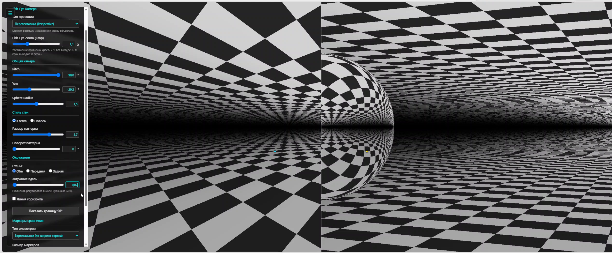
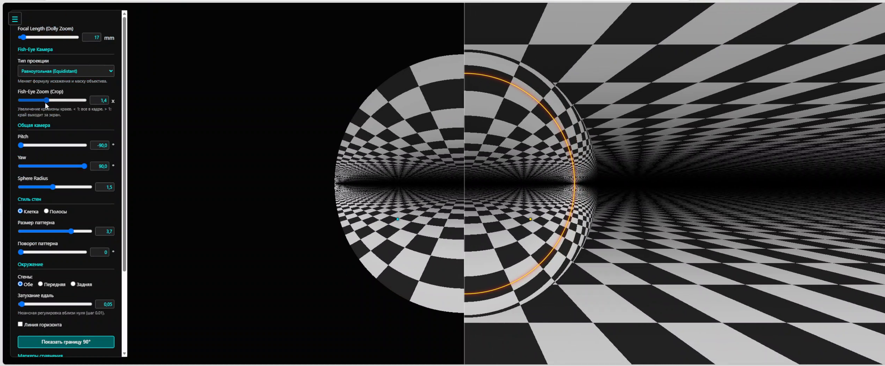
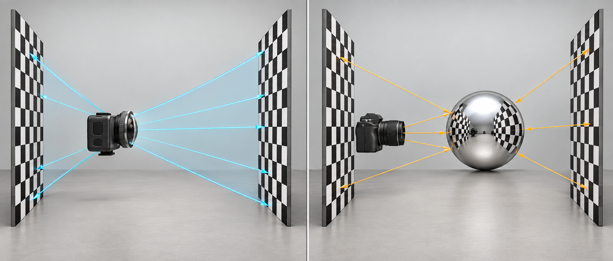
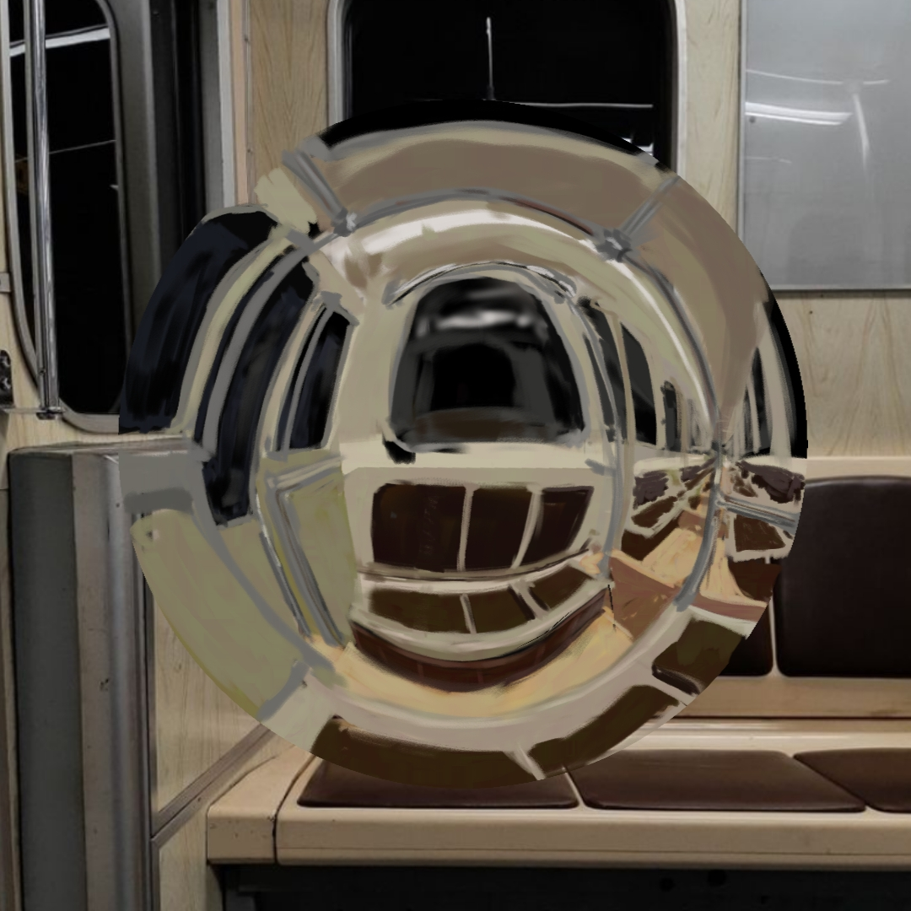
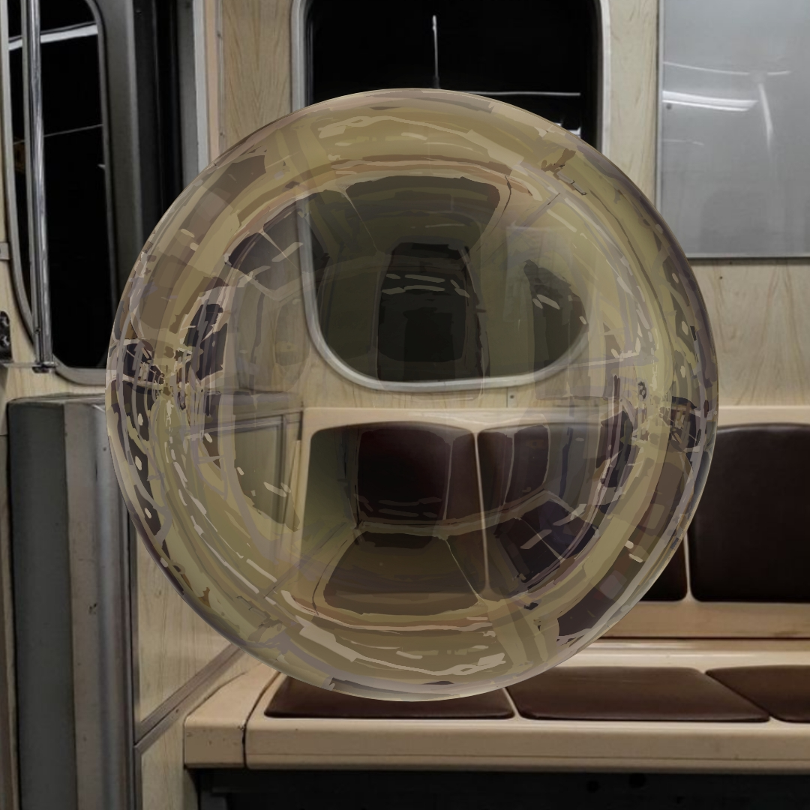

# Fish-eye vs Spherical Mirror

Я сделал этот визуализатор для себя, когда разбирался, как устроены отражения в зеркальном шаре. Мне хотелось не только понять геометрию, но и лучше рисовать такие отражения: видеть, где изгибаются линии, как меняется размер деталей и почему обычная fish-eye проекция не всегда даёт ту же картину.

В приложении слева можно менять тип проекции камеры, а справа смотреть на отражение той же клетчатой сцены в шаре. Параметры можно крутить прямо во время сравнения и использовать результат как наглядный референс для рисунка.

**[Открыть демонстрацию](https://linnkoln.github.io/fisheye-vs-spherical-mirror/)** · **[Гид по проекциям и интерактивный график](https://github.com/linnkoln/fisheye-projection-guide)**

## Как выглядит приложение

[Смотреть видеодемонстрацию с настройками (2:34, MP4)](https://linnkoln.github.io/fisheye-vs-spherical-mirror/docs/demo-video.mp4). В конце записи показан и [связанный график проекций](https://github.com/linnkoln/fisheye-projection-guide).

## Как устроена сцена

Слева камера с переключаемой проекцией расположена между двумя клетчатыми стенами — передней и задней. Справа обычная камера смотрит на зеркальный шар в такой же сцене. Лучи на рисунке условно показывают направление обзора и отражения.

## Что можно проверить в приложении

- Переключать эквидистантную, ортографическую, равнотелесную, стереографическую и перспективную проекции.
- Менять фокусное расстояние, масштаб, наклон и поворот камеры, а также радиус зеркального шара.
- Менять узор и видимость стен, регулировать затухание вдаль.
- Включать линию горизонта и границу 90°, ставить симметричные маркеры кликом по сцене.
- Вращать сцену перетаскиванием и возвращаться к исходному виду кнопкой **Reset View**.

Например, можно выбрать **Ортографическая (Orthographic)** и сравнить центральную область с краями отражения. Затем переключиться на **Равноплощадная (Equisolid)** и посмотреть, почему её радиальная зависимость ближе к отражению при ортографическом наблюдении сферы. Формулы и интерактивные графики я вынес в [отдельный гид](https://github.com/linnkoln/fisheye-projection-guide/blob/main/GUIDE.md).

## Что получилось нарисовать

Я использовал визуализатор как референс: проверял, как в шаре изгибаются линии окон и сидений вагона, и переносил это в рисунок. Ниже — первый вариант, результат работы с референсом и финальная доработка этого результата. Это мои рисунки, а не изображения, автоматически созданные приложением.

| До | После | Финальная доработка варианта «после» |
| --- | --- | --- |
|  |  |  |

## Запуск

1. Откройте [версию на GitHub Pages](https://linnkoln.github.io/fisheye-vs-spherical-mirror/).
2. Или скачайте репозиторий и откройте `index.html` в современном браузере с поддержкой WebGL.

Сборка, пакетный менеджер и сервер не нужны. Если браузер ограничивает открытие локальных файлов и у вас установлен Python, из папки репозитория можно запустить `py -m http.server 8000` в Windows или `python3 -m http.server 8000` в Linux/macOS, затем перейти на `http://localhost:8000/`.

## Файлы

- `index.html` — исходная автономная демонстрация: HTML, CSS, JavaScript и GLSL в одном файле.
- `docs/app-overview.png`, `docs/app-boundary.png` — кадры настоящего приложения из видеозаписи.
- `docs/demo-video.mp4` — видеодемонстрация работы приложения и связанного графика.
- `docs/scene-setup.png` — схема двух установок, созданная для этого репозитория.
- `docs/metro-before.jpg`, `docs/metro-after.jpg`, `docs/metro-final.jpg` — этапы авторского рисунка, для которого использовался визуализатор.

Это учебный эксперимент. Итоговая картинка зависит от камеры, положения сферы и сцены; совпадение одной радиальной формулы ещё не означает, что два способа построения изображения полностью одинаковы. Подробнее об этом — в [гиде](https://github.com/linnkoln/fisheye-projection-guide).
