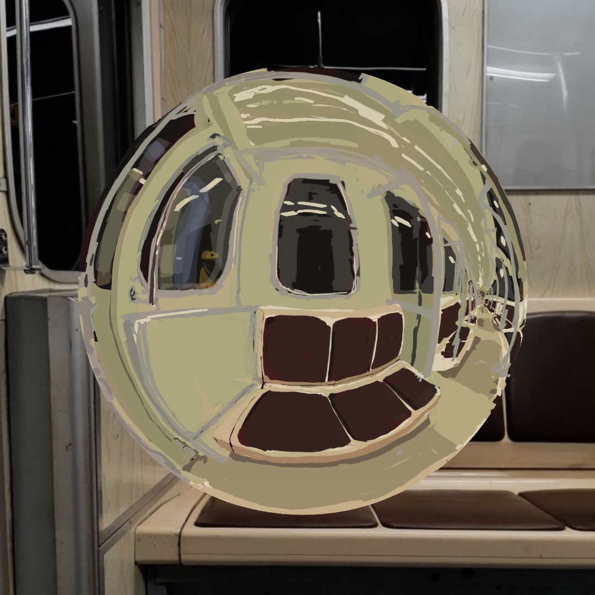
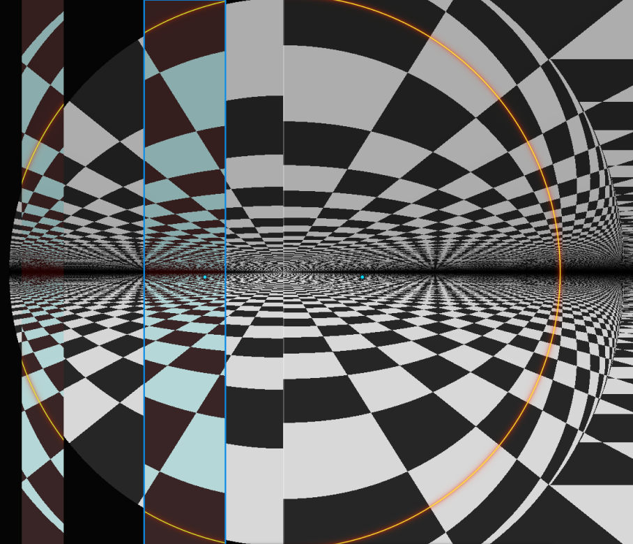

# Fish-eye vs Spherical Mirror

Интерактивная демонстрация различий между проекциями fish-eye камеры и отражением в зеркальной сфере. Слева можно выбрать одну из пяти радиальных проекций, справа отражение рассчитывается трассировкой лучей в WebGL. Клетчатая сцена и симметричные маркеры помогают сравнивать изгиб линий и масштаб деталей.

**[Открыть демонстрацию](https://linnkoln.github.io/fisheye-vs-spherical-mirror/)** · **[Гид по проекциям и интерактивный график](https://github.com/linnkoln/fisheye-projection-guide)**

## Как выглядит приложение

[Смотреть видеодемонстрацию с настройками (2:34, MP4)](https://linnkoln.github.io/fisheye-vs-spherical-mirror/docs/demo-video.mp4). В конце записи показан и [связанный график проекций](https://github.com/linnkoln/fisheye-projection-guide).

## Как устроена сцена

Слева камера с переключаемой проекцией расположена между двумя клетчатыми стенами — передней и задней. Справа обычная камера смотрит на зеркальный шар в такой же сцене. Лучи на рисунке условно показывают направление обзора и отражения.

## Что можно исследовать

- Переключать эквидистантную, ортографическую, равнотелесную, стереографическую и перспективную проекции.
- Менять фокусное расстояние, масштаб, наклон и поворот камеры, а также радиус зеркального шара.
- Менять узор и видимость стен, регулировать затухание вдаль.
- Включать линию горизонта и границу 90°, ставить симметричные маркеры кликом по сцене.
- Вращать сцену перетаскиванием и возвращаться к исходному виду кнопкой **Reset View**.

Для сравнения, описанного в исходных заметках, выберите **Ортографическая (Orthographic)** и посмотрите на центральную область и края изображения. Затем переключитесь на **Равноплощадная (Equisolid)**: её радиальная зависимость близка к отражению при ортографическом наблюдении сферы. Подробности и графики — в [гиде](https://github.com/linnkoln/fisheye-projection-guide/blob/main/GUIDE.md).

## Рисунки, сделанные с помощью визуализатора

Два авторских исследования отражения в вагоне метро. Это рисунки, для которых визуализатор использовался как инструмент сравнения проекций, а не кадры HTML-приложения.

| Исследование 1 | Исследование 2 |
| --- | --- |
|  |  |

## Отдельное сравнение в Figma

Этот коллаж подготовлен в Figma для сравнения деталей. Он не является скриншотом приложения; реальные кадры показаны выше.

## Запуск

1. Откройте [версию на GitHub Pages](https://linnkoln.github.io/fisheye-vs-spherical-mirror/).
2. Или скачайте репозиторий и откройте `index.html` в современном браузере с поддержкой WebGL.

Сборка, пакетный менеджер и сервер не нужны. Если браузер ограничивает открытие локальных файлов и у вас установлен Python, из папки репозитория можно запустить `py -m http.server 8000` в Windows или `python3 -m http.server 8000` в Linux/macOS, затем перейти на `http://localhost:8000/`.

## Файлы

- `index.html` — исходная автономная демонстрация: HTML, CSS, JavaScript и GLSL в одном файле.
- `docs/app-overview.png`, `docs/app-boundary.png` — кадры настоящего приложения из видеозаписи.
- `docs/demo-video.mp4` — видеодемонстрация работы приложения и связанного графика.
- `docs/scene-setup.png` — схема двух установок, созданная для этого репозитория.
- `docs/metro-study-1.jpg`, `docs/metro-study-2.jpg` — авторские рисунки, сделанные с помощью визуализатора.
- `docs/figma-comparison.png` — коллаж для сравнения из Figma.

Это исследовательская визуализация. Итоговая картинка зависит от параметров камеры, положения сферы и сцены; совпадение одной радиальной формулы само по себе не доказывает эквивалентность всех проекций. Для графического объяснения см. [связанный проект](https://github.com/linnkoln/fisheye-projection-guide).
